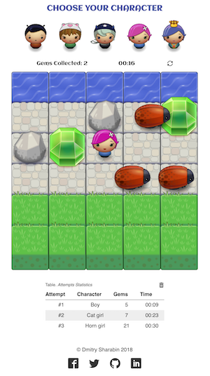
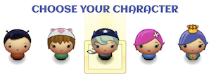
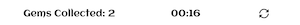
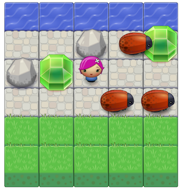
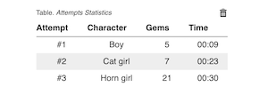
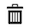

# Project #3.  Classic Arcade Game Clone
The  Classic Arcade Game Clone Project is the third self-paced project in _Udacity Nanodegree Program_.

The goal of the project is to recreate the classic arcade game [Frogger](to recreate the classic arcade game Frogger).

## How the Game Works
In this game you have a _Player_ and _Enemies_ (bugs). The goal of the player is to reach the water, without colliding into any one of the enemies.

## Gameplay
The user can move the player left, right, up and down using arrow
keys on the keyboard.

The enemies move at varying speeds on the paved block portion of the game board.

Once the player collides with an enemy, the game is reset and the player moves back to the starting square.

Once the player reaches the water (i.e., the top of the game board) the game board is reset, the player moves back to the starting square and the difficulty of the game increases.

## Interface

### Characters
The user is allowed to select the image for the player character at any time: before starting the game and during the game itself.

### Stats Panel

Parts of the _Stats Panel_ (left to right):

1. Number of collected gems
1. Timer
1. **Reset Game** button

_Timer_ starts as soon as the player starts moving.

### Game Board

On the game board there are some _gems_ of different colors and some _rocks_.

The rocks are obstacles that need to be bypassed.

**Attention!** The enemies have _super powers_: they can pass through the gems and the rocks!

### Attempts Results Table
The goal of the game is to collect as _many gems_ as possible in the _minimum time_.

The game stores the results of a user's attempts using browser's local storage.

To clear the table use **Clear Stats** button .

## Game Launch
To start the game open file `index.html` in a browser.

## License
The content of this repository is licensed under a [Creative Commons Attribution License](http://creativecommons.org/licenses/by/3.0/us/).
